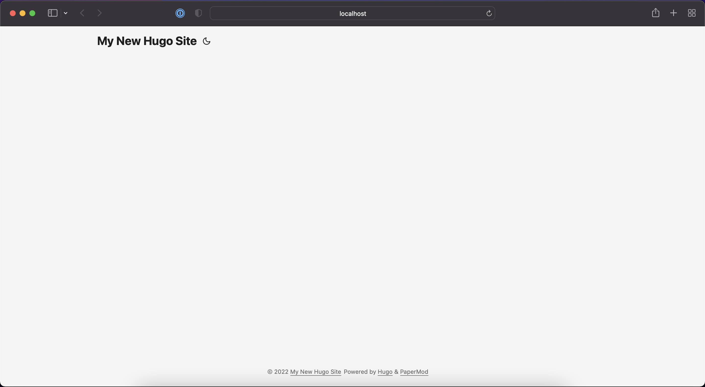
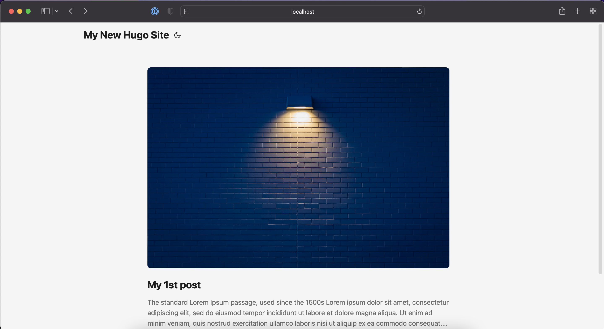

# Make your own blog in a day (pt.1 Create the site)

A portfolio is incredibly imporatant for a software engineer, especially those that are starting out. A portfolio can be used to impressed your employer while also showing your friends what you have done. As a software engineer, you should have the skills to create your own website and your own blog. If you don't have any experience in web, this should be the easiest way you can quickly deploy your portfolio.

Quick reference link:

- Me! (jysim3.com)

### Prerequisites

Before you start reading this, you should:

- have a text editor of your choice
- a basic understanding of markdown files and git

## 1. Creating your blog

To create your blog, we will be using a static site generator, specifically [hugo](link). Hugo is one of the most popular open-source static site generators, generating all the html file after you write your content using markdown.

1. First, install [hugo]()

> Note: The installation method below are copied from [Hugo](https://gohugo.io/getting-started/installing). Head over there for a more detailed version.




1. First install [brew](), a package manager for mac
2. Run the following:

```sh
brew install hugo
```




Simply install using your favourite package manager. For example,

```
sudo apt-get install hugo
```




1. Go to the [Hugo Releases](https://github.com/gohugoio/hugo/releases) page.
1. The latest release is announced on top. Scroll to the bottom of the release announcement to see the downloads. They’re all ZIP files.
1. Find the Windows files near the bottom (they’re in alphabetical order, so Windows is last) – download either the 32-bit or 64-bit file depending on whether you have 32-bit or 64-bit Windows. (If you don’t know, see [here](https://www.howtogeek.com/howto/21726/how-do-i-know-if-im-running-32-bit-or-64-bit-windows-answers/).)
1. Move the ZIP file into your C:\Hugo\bin folder.
1. Double-click on the ZIP file and extract its contents. Be sure to extract the contents into the same C:\Hugo\bin folder – Windows will do this by default unless you tell it to extract somewhere else.
1. You should now have three new files: The hugo executable (hugo.exe), LICENSE, and README.md.
1. Now you need to add Hugo to your Windows PATH settings:

For Windows 10 Users:

- Right click on the Start button.
- Click on System.
- Click on Advanced System Settings on the right.
- Click on the Environment Variables… button on the bottom.
- In the User variables section, select the row labeled “Path” and click the Edit… button.
- Click the Browse… button and select the directory to which hugo.exe was extracted, which is C:\Hugo\bin if you went by the instructions above. The path entry should be the folder where Hugo lives and not the binary itself.
- Click OK at every window to exit.




2. Create a new project

```
hugo new site myblog
Congratulations! Your new Hugo site is created in /Users/jysim/Documents/myblog.

Just a few more steps and you're ready to go:

1. Download a theme into the same-named folder.
   Choose a theme from https://themes.gohugo.io/ or
   create your own with the "hugo new theme <THEMENAME>" command.
2. Perhaps you want to add some content. You can add single files
   with "hugo new <SECTIONNAME>/<FILENAME>.<FORMAT>".
3. Start the built-in live server via "hugo server".

Visit https://gohugo.io/ for quickstart guide and full documentation.
```

This will create a new website folder for you called `myblog`.

Recommended: Set up a new git repository on it by

```
cd myblog
git init
```

3. Add a theme

There are a lot of themes for you to choose from. See a list of themes [here](https://themes.gohugo.io/). The site you're reading in uses PaperMod. You can add it by cloning it into your hugo folder.

```sh
# ../myblog $
git submodule add --depth=1 https://github.com/adityatelange/hugo-PaperMod.git themes/PaperMod
```

Then, add the theme to the site configuration:

```
echo theme = \"PaperMod\" >> config.toml
```

4. Start the hugo server

View your website by running a hugo server

```
hugo server -D
```

Congratulations! You can now look at your website by going to http://localhost:1313/.



5. Adding content

You can add anything you want in the content folder. But for the time being, you can run the following command.

```
mkdir -p content/posts
echo "---\ntitle: My 1st post\ndate: 2022-05-15T11:30:03+00:00\ncover:\n    image: \"https://images.unsplash.com/photo-1553095066-5014bc7b7f2d?ixlib=rb-1.2.1&ixid=MnwxMjA3fDB8MHxwaG90by1wYWdlfHx8fGVufDB8fHx8&auto=format&fit=crop&w=1742&q=80\"\n---\n\nThe standard Lorem Ipsum passage, used since the 1500s\nLorem ipsum dolor sit amet, consectetur adipiscing elit, sed do eiusmod tempor incididunt ut labore et dolore magna aliqua. Ut enim ad minim veniam, quis nostrud exercitation ullamco laboris nisi ut aliquip ex ea commodo consequat. Duis aute irure dolor in reprehenderit in voluptate velit esse cillum dolore eu fugiat nulla pariatur. Excepteur sint occaecat cupidatat non proident, sunt in culpa qui officia deserunt mollit anim id est laborum." > content/posts/my-first-posts.md
```

You can find your posts in http://localhost:1313/posts/my-first-posts/



6. Customise your page

To further customise your page, look at [PaperMod](https://github.com/adityatelange/hugo-PaperMod) to find out how to make the blog _yours_.

You can do things such as:

- Add description to your posts
- Add navigation to the navigation bar above
- Social links
- Share buttons
- and more


> Go to [part 2](./part-2) to upload your blog to your own site.
